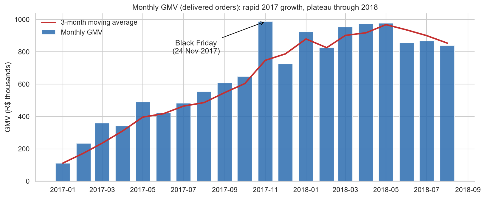
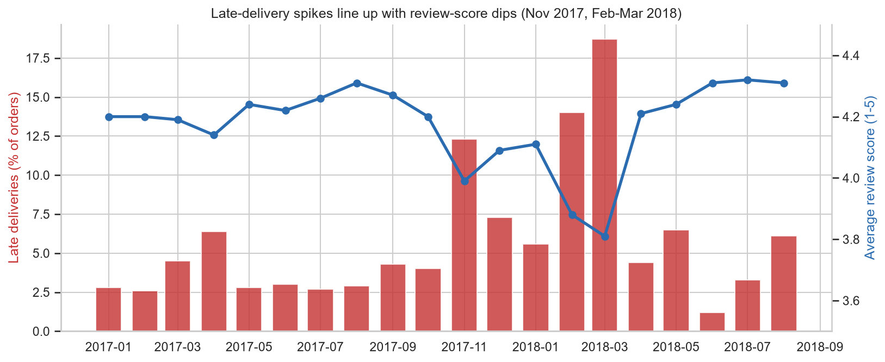
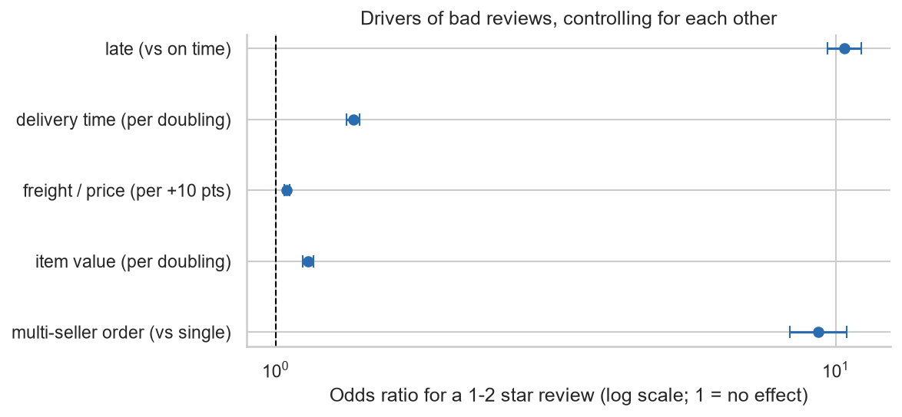
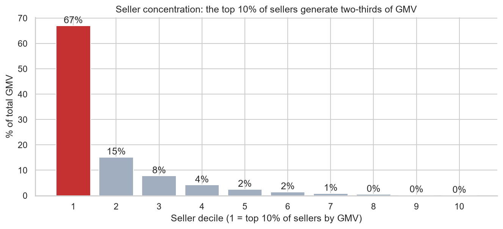
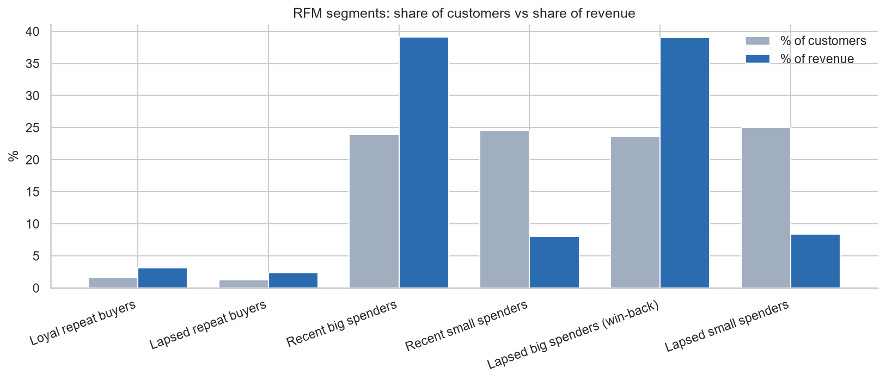

# Olist E-commerce Analytics: Delivery, Customers and Satisfaction

**Real data, fully reproducible.** About 96,000 delivered orders (R$13.2M GMV) from the public Olist Brazilian
marketplace dataset (9 relational tables, 2016-2018). SQL for the analysis, Python for charts and statistics.

> **Headline:** Late delivery is the single biggest driver of bad reviews. Orders that arrive after the promised
> date score **2.27 / 5** versus **4.29 / 5** for on-time orders, and the promise matters more than speed: orders
> that took 21+ days but arrived on time still scored 3.92. Meanwhile **97% of customers never come back**, so
> growth (+141% year over year) came from new customers, then flattened in 2018.

## Business questions
1. How did the business grow, and what do the peaks show?
2. Where and when does delivery fail?
3. Does late delivery hurt satisfaction, and does that survive statistical controls?
4. Where does revenue concentrate (categories, sellers, regions)?
5. What does the customer base look like, and does a bad first order cost a repeat purchase?

## Key findings
All figures come from the SQL in `/sql` and `notebooks/olist_analysis.ipynb`; headline values are saved to
`outputs/key_numbers.json`.

### 1. Growth was explosive in 2017, then plateaued
Jan-Aug 2018 vs Jan-Aug 2017: orders **+140%**, GMV **+141%** (average order value flat at about R$136).
But 2018 monthly GMV stayed in a narrow band (R$826k to R$978k): it peaked in May 2018 at R$978k and drifted down to R$839k by August.
Black Friday 2017 (24 Nov) produced **1,147 orders in one day, about 7.5x a typical day** in the weeks before.



### 2. Delivery: usually fine, but two periods broke it
- Overall **6.8% of orders were late**; average delivery took 12.5 days against 23.6 days promised, and
  **79% arrived 7+ days before the promised date** (estimates are heavily padded).
- Lateness spiked in **Nov 2017 (12.4%)** and **Feb-Mar 2018 (14.1% and 19.0%)**. The dataset cannot tell us why.
- Most of the time is carrier transit (9.4 days) rather than seller handling (2.8 days).
- Geography matters: **64% of orders cross state lines** and take 15.2 days vs 7.9 for same-state orders.
  North-east states have the worst late rates (Alagoas 21.5%, Maranhao 17.5%) versus 4.5% in Sao Paulo.
- Lateness is **not a few bad sellers**: among sellers with 50+ orders, those with 20%+ late rates account for only 1.5% of late orders;
  most late orders come from ordinary sellers in the 5-20% band. That points to logistics and capacity,
  not seller policing.



### 3. Late delivery wrecks reviews (and it is not just a speed effect)
| | Orders | Avg review | % 1-2 stars |
|---|---|---|---|
| On time / early | 89,182 | **4.29** | 9.2% |
| Late | 6,378 | **2.27** | 62.4% |

- Mean difference **-2.02 stars** (95% CI -2.06 to -1.98); Mann-Whitney U p < 1e-300.
  A random late order scores lower than a random on-time order **82% of the time**.
- Score falls off a cliff past the promise: 1-3 days late averages 3.29; 4+ days late averages 2.10 or less.
- **Promise beats speed:** among orders that took 21+ days, those delivered on time scored **3.92**, those that were late scored **2.13**.
- In a logistic regression for 1-2 star reviews, controlling for delivery time, freight-to-price ratio, item
  value and multi-seller orders, late delivery has an **odds ratio of about 10.4** (95% CI 9.7 to 11.1).
  High freight cost matters far less (OR 1.05 per +10 points of freight/price).
- Month by month, late % and average score move together (correlation **-0.92**, 20 months).
- **Open question:** multi-seller orders (1.3% of orders) average only 2.86 stars despite being rarely late (1.0%). Split shipments are a plausible
  explanation, but the data cannot confirm it.



### 4. Revenue is concentrated
- **18 of 74 categories generate 80% of GMV.** Top three: health_beauty (9.3%), watches_gifts (8.8%), bed_bath_table (7.8%).
- office_furniture is the weakest large category for satisfaction (3.52 average review across 1,239 reviewed orders).
- **The top 10% of sellers generate 67% of GMV.** Sao Paulo holds 59.5% of sellers and 64.4% of GMV.



### 5. Customers: almost nobody comes back
- **97.0% of customers placed exactly one order.** Returning customers were roughly 2.5% of monthly revenue,
  with no upward trend.
- Repeat buyers who do return take a median of 29 days, but **30.5% of second orders come within 24 hours**,
  which looks more like split checkouts than loyalty.
- The RFM "lapsed big spender" segment is **about 22,000 customers holding 39% of revenue**: the obvious win-back target.
- A bad first review did **not** significantly reduce repeat purchase (4.66% vs 5.15%, chi-square p = 0.45).
  The retention problem is not explained by first-order experience in this data.



## Recommendations (grounded in the findings)
1. **Manage the delivery promise, not just delivery speed.** Add capacity planning for November and the
   Feb-Mar window, and set more realistic estimates for the north-east where late rates are 12-21% even with promises of 29-33 days.
2. **Investigate multi-seller orders** (split shipments, partial deliveries) before assuming it is a seller-quality issue.
3. **Treat retention as the untapped lever:** growth stalled in 2018 while 97% of customers bought once. Test win-back campaigns on the lapsed big spenders.
4. **Watch seller concentration risk:** two-thirds of GMV depends on about 300 sellers.

## Limitations (read these before quoting any number)
- Observational data: the late-delivery effect is a strong association that survives controls, not proof of causation.
- Reviews are voluntary. Unhappy customers comment far more (78% of 1-star reviews have text vs 36% of 5-star), so scores are not a random sample.
- GMV is item price, not Olist's own revenue (the marketplace earns a commission, which is not in the data).
- One marketplace, one country, a 2016-2018 snapshot. No marketing cost, margin or competitor data.
- Because 97% bought once, RFM recency mostly reflects *when* a customer first bought. Frequency is scored 1 / 2 / 3+.
- Delivered orders only (97% of orders); cancelled and in-transit orders are excluded from trend metrics.
- The analysis window is Jan 2017 - Aug 2018; earlier and later months are nearly empty.

## Data quality issues found and handled (`sql/01_data_audit.sql`)
| Issue | Handling |
|---|---|
| `customer_id` is per order: 99,441 ids but only 96,096 real customers | Use `customer_unique_id` everywhere |
| 99,224 review rows but only 98,410 distinct `review_id`; 547 orders have several reviews; 768 orders have none | Keep one review per order (latest answer); orders with no review are left out of score analyses |
| 166 orders with carrier date before purchase; 8 "delivered" orders with no delivery date | Excluded from delivery metrics |
| 610 products with no category; 13 with no translation | Labelled `unknown` / original name, not dropped |
| Months outside Jan 2017 - Aug 2018 nearly empty | Study window restricted |
| Estimated delivery stored at midnight | "Late" compared at date level so same-day delivery counts as on time |

## Project structure
```
sql/            00_schema, 00b_load_postgres, 01_data_audit, 02_cleaning_views, 03_revenue_trends,
                04_delivery_performance, 05_category_seller_analysis, 06_customer_rfm, 07_satisfaction_drivers
scripts/        build_db.py (load + row-count check), run_sql.py (run queries, save CSVs)
notebooks/      olist_analysis.ipynb (charts, hypothesis tests, regression)
outputs/        charts/, results/ (one CSV per query), key_numbers.json
data/           README.md (download instructions); raw CSVs go in data/raw/ (not committed)
docs/           resume_and_interview_prep.md
```

## Skills demonstrated
| Area | Where |
|---|---|
| Multi-table joins, CTEs, views | `02_cleaning_views.sql`, all analysis files |
| Window functions (`LAG`, `RANK`, `NTILE`, `ROW_NUMBER`, running totals, moving averages) | `03`, `05`, `06` |
| Conditional aggregation (`FILTER`, `CASE`), percentiles | `04`, `06`, `07` |
| Data auditing and documented cleaning decisions | `01`, `02` |
| Hypothesis testing (Mann-Whitney, chi-square), logistic regression, odds ratios | notebook sections 3 and 5 |
| RFM segmentation, cohort comparison with equal observation windows | `06` |
| Reproducible pipeline | `build_db.py`, `run_sql.py`, notebook reads SQL files directly |

## Reproduce it
```bash
pip install -r requirements.txt
# download the data into data/raw/ (see data/README.md)
python scripts/build_db.py
python scripts/run_sql.py
jupyter nbconvert --to notebook --execute --inplace notebooks/olist_analysis.ipynb
```
The queries are written in the PostgreSQL-compatible subset of SQL and were **tested on DuckDB**
(no server needed). To use PostgreSQL, run `sql/00_schema.sql` and `sql/00b_load_postgres.sql`, then the numbered files.
